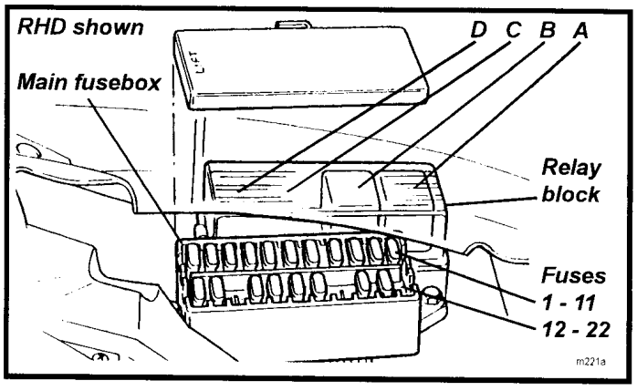
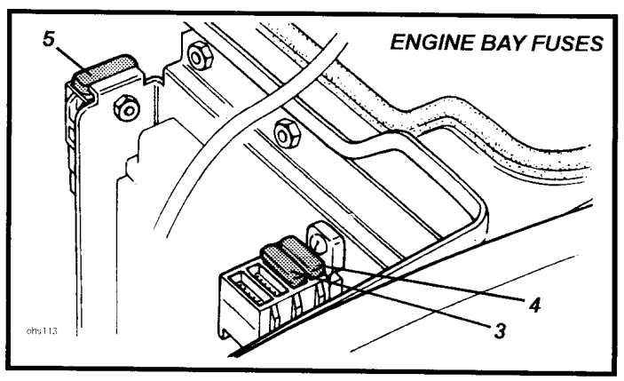
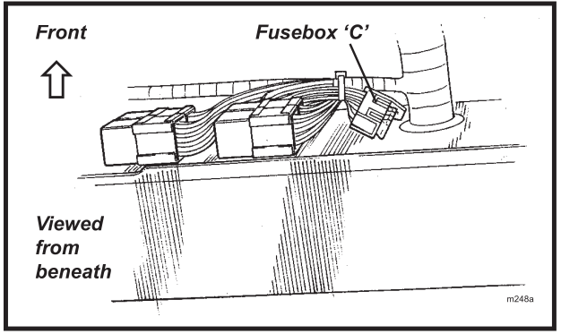
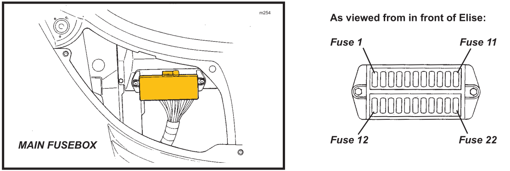
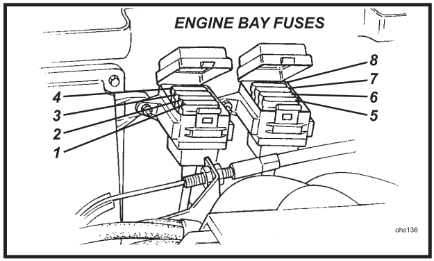

# Fusibles

## Elise S2 (Rover)

**Figura:** Caja principal de fusibles

| Slot | Color     | Valor | Circuito                                        |
|-----:|-----------|------:|-------------------------------------------------|
|    1 | Amarillo  |    20 | Toma de alimentación auxiliar                   |
|    2 | Gris      |     2 | Sirena de la alarma                             |
|    3 | Amarillo  |    20 | Ventilador interior                             |
|    4 | Azul      |    15 | Motor del limpiaparabrisas                      |
|    5 | Marrón    |   7.5 | Luz de freno                                    |
|    6 | Marrón    |   7.5 | Intermitentes                                   |
|    7 | Rojo      |    10 | Servicios de encendido                          |
|    8 | Marrón    |   7.5 | Servicios de batería                            |
|    9 | Rojo      |    10 | Luces de emergencia                             |
|   10 | Marrón    |   7.5 | Claxon                                          |
|   11 | Rojo      |    10 | Alimentación alarma; luz interior               |
|   12 | Blanco    |    25 | Ventilador de refrigeración                     |
|   13 | Marrón    |   7.5 | Encendido del sistema de audio                  |
|   15 | Marrón    |   7.5 | Audio +ve; módulo de interruptores              |
|   16 | Rojo      |    10 | Luces de posición; antiniebla trasero           |
|   17 | Rojo      |    10 | Luz de cruce izquierda (Dip beam LH)            |
|   18 | Rojo      |    10 | Luz de cruce derecha (Dip beam RH)              |
|   20 | Azul      |    15 | Luz larga izquierda (Main beam LH)              |
|   21 | Azul      |    15 | Luz larga derecha (Main beam RH)                |
|   A  |           |       | Relé del claxon                                 |
|   B  |           |       | Relé ventilador de refrigeración                |

**Figura:** Caja principal de fusibles

| Slot | Color     | Valor | Circuito                                        |
|-----:|-----------|------:|-------------------------------------------------|
|    3 | Amarillo  |    20 | Inmovilizador                                   |
|    4 | Amarillo  |    20 | Bomba de combustible                            |
|    5 | Negro     |    80 | Alternador                                      |

## Elise S2 (Toyota)

**Figura:** Fusibles interiores

| Fusible | Color     | Valor | Circuito                    |
|--------:|-----------|------:|-----------------------------|
| C1      | Amarillo  |    20 | Ventilador interior         |
| C2      | Azul      |    15 | Motor del limpiaparabrisas  |
| C3      | Marrón    |   7.5 | Entrada de audio (“key-in”) |
| C4      | Rojo      |    10 | Compresor del AC            |

**Figura:** Caja principal de fusibles

| #  | Color     | Valor | Descripción                                      |
|---:|-----------|------:|--------------------------------------------------|
|  1 | Amarillo  |    20 | Toma de alimentación auxiliar                    |
|  2 | Gris      |     2 | Sirena de la alarma                              |
|  3 | Amarillo  |    20 | Ventanilla del conductor                         |
|  4 | Amarillo  |    20 | Ventanilla del pasajero                          |
|  5 | Marrón    |   7.5 | Luz de freno                                     |
|  6 | Marrón    |   7.5 | Intermitentes                                    |
|  7 | Rojo      |    10 | Arranque                                         |
|  8 | Marrón    |   7.5 | Batería                                          |
|  9 | Rojo      |    10 | Luces de emergencia                              |
| 10 | Marrón    |   7.5 | Claxon                                           |
| 11 | Rojo      |    10 | Alimentación alarma, luz interior                |
| 12 | Rojo      |    10 | ABS                                              |
| 13 | Violeta   |     3 | Encendido ECU                                    |
| 14 | Amarillo  |    20 | Ventiladores radiador; 1 y 2 lento, 1 rápido     |
| 15 | Marrón    |   7.5 | Radio, interruptor                               |
| 16 | Rojo      |    10 | Luces de posición / No USA: Antiniebla trasero   |
| 17 | Rojo      |    10 | Luz de cruce izquierda (Dip beam LH)             |
| 18 | Rojo      |    10 | Luz de cruce derecha (Dip beam RH)               |
| 19 | Amarillo  |    20 | Relé compresor A/C, ventilador radiador 2 rápido |
| 20 | Azul      |    15 | Luz larga izquierda (Main beam LH)               |
| 21 | Azul      |    15 | Luz larga derecha (Main beam RH)                 |
| 22 | Marrón    |   7.5 | Cierre centralizado (CDL)                        |

**Figura:** Fusibles compartimiento del motor

| Fusible | Color     | Valor | Circuito                                   |
|--------:|-----------|------:|--------------------------------------------|
| R1      | Amarillo  |    20 | Bomba de combustible                       |
| R2      | Violeta   |     3 | Inmovilizador                              |
| R3      | Marrón    |     5 | Señal del alternador                       |
| R4      | Marrón    |     5 | Alimentación de batería de la ECU          |
| R5      | Marrón    |     5 | Calentadores de O₂                         |
| R6      | Marrón    |   7.5 | VSV de VVT, VVL, IAC                       |
| R7      | Rojo      |    10 | Inyectores, bobinas de encendido           |
| R8      | Marrón    |     5 | Bomba de recirculación                     |
