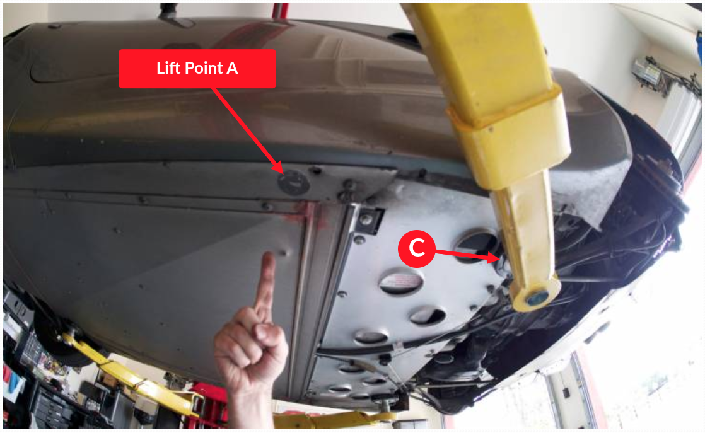

# Subir el coche

**Figura:** Puntos

**Figura:** Puntos A, B y C

**Figura:** Puntos A

**Figura:** Puntos C

**Figura:** Puntos D

Ver: <https://howtune.com/articles/124-locating-the-correct-lift-points-on-a-lotus-elise>
